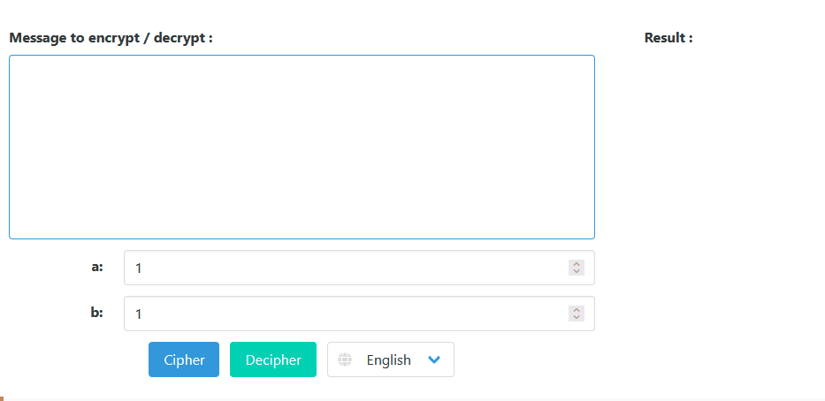

## Caesar cipher

  

A simple project developed with Html, Css and Javascript that allows us decrypt/encrypt a message with Caesar cipher, also known as shift cipher.

## :rocket: Built With

- :page_facing_up: HTML
- :art: [Bulma](https://bulma.io/) - CSS Framework
- :page_with_curl: Javascript

## :wrench: Setup

1. Clone this :open_file_folder: repository.
2. `cd` into it.
3. Open :earth_americas: index.html in your browser to use it.

## :computer: How to use?

### Encrypt message

### Decrypt message

## :point_right: Online demo

Visit: https://saul-lara.github.io/Caesar-cipher/

## :green_book: License

Code in this repository is open-sourced software licensed under the [MIT license](http://opensource.org/licenses/mit-license.php).
See the [LICENSE](LICENSE) file for details.

Saul Hdz Lara
